# PGRO Lead Workflow - Mermaid Diagram

This document contains a comprehensive Mermaid diagram showing the complete PGRO Lead workflow from file upload to allocation, emailing, interview viewing, review, and note writing.

## Complete PGRO Lead Workflow

```mermaid
flowchart TD
    Start([PGRO Lead Starts]) --> Upload[Upload File]
  
    Upload --> UploadType{Upload Type?}
    UploadType -->|Batch Upload| BatchUpload[Batch Upload Multiple Files]
    UploadType -->|Single File| SingleUpload[Upload Single File]
  
    BatchUpload --> FileProcess[File Processing]
    SingleUpload --> FileProcess
  
    FileProcess --> ExtractText[Extract Text from PDF/DOCX]
    ExtractText --> CreateApplicant[Create Applicant Record]
    CreateApplicant --> LLMSummary[Generate LLM Summary]
    LLMSummary --> GenerateEmbedding[Generate Embedding Vector]
    GenerateEmbedding --> StoreDB[(Store in Database)]
  
    StoreDB --> ViewApplicant[View Applicant Detail Page]
  
    ViewApplicant --> FindMatches[Click 'Find Matches']
    FindMatches --> VectorSearch[Vector Similarity Search]
    VectorSearch --> FilterStaff[Filter by Eligibility & Capacity]
    FilterStaff --> GenerateExplanations[Generate LLM Explanations]
    GenerateExplanations --> DisplayMatches[Display Ranked Matches]
  
    DisplayMatches --> AllocationDecision{Create Allocation?}
    AllocationDecision -->|Yes| CreateAllocation[Create Allocation]
    AllocationDecision -->|No| ViewApplicant
  
    CreateAllocation --> SetRole{Set Role}
    SetRole -->|Director of Studies| DOSRole[DOS Role]
    SetRole -->|Co-Supervisor| CoSupervisorRole[Co-Supervisor Role]
    SetRole -->|Advisor| AdvisorRole[Advisor Role]
  
    DOSRole --> SaveAllocation[Save Allocation]
    CoSupervisorRole --> SaveAllocation
    AdvisorRole --> SaveAllocation
  
    SaveAllocation --> ConfirmAllocation{Confirm Allocation?}
    ConfirmAllocation -->|Yes| Confirm[Mark as Confirmed]
    ConfirmAllocation -->|No| Unconfirmed[Keep as Suggestion]
  
    Confirm --> UpdateStatus[Update Applicant Status]
    UpdateStatus --> SendEmail[Send Email to Supervisor]
  
    Unconfirmed --> ViewAllocations[View Allocations Board]
    SendEmail --> EmailSent[Email Sent Notification]
    EmailSent --> ViewAllocations
  
    ViewAllocations --> ReviewOptions{What to do next?}
  
    ReviewOptions -->|View Review| ViewReview[View Staff Review]
    ReviewOptions -->|View Interview| ViewInterview[View Interview Record]
    ReviewOptions -->|Write Notes| WriteNotes[Write Allocation Notes]
    ReviewOptions -->|Send Email| SendAnotherEmail[Send Email to Supervisor]
    ReviewOptions -->|Export Data| ExportCSV[Export Allocations CSV]
  
    ViewReview --> LoadReview[Load Staff Review Data]
    LoadReview --> DisplayReview[Display Review Form]
    DisplayReview --> ReviewDetails[View Review Details:<br/>- Recommendation<br/>- Research Quality<br/>- Methodology<br/>- Feasibility<br/>- Overall Assessment]
    ReviewDetails --> ReviewNotes[View Review Notes]
    ReviewNotes --> BackToAllocations[Return to Allocations]
  
    ViewInterview --> LoadInterview[Load Interview Record]
    LoadInterview --> DisplayInterview[Display Interview Form]
    DisplayInterview --> InterviewDetails[View Interview Details:<br/>- Applicant Background<br/>- Research Proposal Discussion<br/>- Motivation Assessment<br/>- Skills Evaluation<br/>- Supervision Expectations<br/>- Overall Impression]
    InterviewDetails --> InterviewNotes[View Interview Notes]
    InterviewNotes --> BackToAllocations
  
    WriteNotes --> OpenNotesPanel[Open Notes Panel]
    OpenNotesPanel --> EnterNoteText[Enter Note Text]
    EnterNoteText --> SendToStaff{Send to Staff?}
    SendToStaff -->|Yes| SendNoteEmail[Send Note Email to Supervisor]
    SendToStaff -->|No| SaveNote[Save Note Only]
    SendNoteEmail --> SaveNote
    SaveNote --> NoteSaved[Note Saved]
    NoteSaved --> ThreadView[View Note Thread]
    ThreadView --> ReplyNote{Reply to Note?}
    ReplyNote -->|Yes| EnterNoteText
    ReplyNote -->|No| BackToAllocations
  
    SendAnotherEmail --> SelectAllocation[Select Allocation]
    SelectAllocation --> TriggerEmail[Trigger Email Service]
    TriggerEmail --> EmailContent[Prepare Email Content:<br/>- Applicant Details<br/>- Application Summary<br/>- Allocation Role<br/>- Frontend Link]
    EmailContent --> SendGrid[Send via SendGrid]
    SendGrid --> EmailConfirmation[Email Confirmation]
    EmailConfirmation --> BackToAllocations
  
    ExportCSV --> GenerateExport[Generate CSV Export]
    GenerateExport --> DownloadCSV[Download CSV File]
    DownloadCSV --> BackToAllocations
  
    BackToAllocations --> ReviewOptions
  
    style Start fill:#e1f5ff
    style Upload fill:#fff4e1
    style FindMatches fill:#e8f5e9
    style CreateAllocation fill:#e8f5e9
    style Confirm fill:#c8e6c9
    style SendEmail fill:#fff9c4
    style ViewReview fill:#f3e5f5
    style ViewInterview fill:#f3e5f5
    style WriteNotes fill:#e1bee7
    style ExportCSV fill:#b2ebf2
```



## Workflow Steps Description

### 1. Upload File

- **Batch Upload**: Upload multiple files at once (proposals, CVs, transcripts, application forms)
- **Single Upload**: Upload individual files to existing applicants
- Files are processed asynchronously in the background

### 2. File Processing

- Text extraction from PDF/DOCX files
- Applicant record creation (if proposal file)
- LLM summarization to generate structured summary
- Embedding vector generation for matching

### 3. Find Matches

- Vector similarity search using pgvector
- Filter by eligibility (can_be_dos, degree type support)
- Check capacity (current vs max load)
- Generate AI-powered explanations for each match

### 4. Create Allocation

- Select supervisor from matches
- Set role (DOS, Co-Supervisor, or Advisor)
- Save allocation (as suggestion or confirmed)

### 5. Confirm Allocation

- Mark allocation as confirmed
- Update applicant status
- Automatically send email to supervisor

### 6. Send Email

- Email includes applicant details, application summary, and allocation role
- Provides link to staff portal for review
- Email sent via SendGrid service

### 7. View Staff Review

- Access review form submitted by supervisor
- View recommendation (Interview, Revise Proposal, or Reject)
- Review detailed assessment fields
- View review notes and comments

### 8. View Interview Record

- Access interview record form
- View comprehensive interview assessment
- Review applicant background, proposal discussion, skills evaluation
- View supervision expectations and overall impression

### 9. Write Notes

- Create allocation-specific notes
- Support threaded conversations (replies)
- Option to send notes to supervisor via email
- View note history and thread

### 10. Export Data

- Export allocations to CSV format
- Includes applicant, programme, intake, DoS, and supervisors
- For Registry and reporting purposes

## Key Features

- **Asynchronous Processing**: File processing happens in background
- **AI-Powered Matching**: Vector similarity search with LLM explanations
- **Email Integration**: Automated email notifications via SendGrid
- **Review Tracking**: Complete audit trail of reviews and interviews
- **Collaboration**: Notes system for team communication
- **Export Capabilities**: CSV export for external systems

## Status Flow

```
NEW → UNDER_REVIEW → SUPERVISOR_CONTACTED → ACCEPTED/REJECTED
```

# Maintainer

Dr. Mabrouka Abuhmida
Research & Innovation Lead
University of South Wales

**Last Updated:** November 24, 2025

## Related Documentation

- [Matching and Allocation Logic](./matching_and_allocation_logic.md)
- [Database Schema](./database_schema.md)
- [API Reference](./api_reference.md)
- [User Manual](./USER_MANUAL.md)
