# Staff Workflow - Mermaid Diagram

This document contains a comprehensive Mermaid diagram showing the complete Staff workflow from receiving email notification to reviewing applications, conducting interviews, and managing notes.

## Complete Staff Workflow

```mermaid
flowchart TD
    Start([Staff Member Starts]) --> ReceiveEmail[Receive Email Notification]
  
    ReceiveEmail --> EmailContent[Email Contains:<br/>- Applicant Details<br/>- Application Summary<br/>- Allocation Role<br/>- Link to Staff Portal]
  
    EmailContent --> ClickLink[Click Link in Email]
    ClickLink --> Login[Login to Staff Portal]
  
    Login --> StaffPortal[Staff Portal Dashboard]
  
    StaffPortal --> ViewAllocations[View My Allocations]
  
    ViewAllocations --> LoadAllocations[Load Allocations List]
    LoadAllocations --> DisplayAllocations[Display Allocation Cards:<br/>- Applicant Name<br/>- Programme Type<br/>- Intake Term/Year<br/>- Role Badge<br/>- Match Score<br/>- Status]
  
    DisplayAllocations --> SelectAllocation{Select Allocation?}
    SelectAllocation -->|Yes| ClickReview[Click 'Review Application']
    SelectAllocation -->|No| ViewAllocations
  
    ClickReview --> LoadReviewPage[Load Review Page]
  
    LoadReviewPage --> LoadApplicantData[Load Applicant Data]
    LoadApplicantData --> LoadDocuments[Load Documents:<br/>- Proposal<br/>- CV<br/>- Transcript<br/>- Application Form]
  
    LoadDocuments --> DisplayReview[Display Review Interface]
  
    DisplayReview --> ReviewLayout[Side-by-Side Layout:<br/>Left: Application Details<br/>Right: Review Form]
  
    ReviewLayout --> ViewApplication[View Application Details:<br/>- Summary Text<br/>- Primary Theme<br/>- Keywords<br/>- Research Areas<br/>- Documents]
  
    ViewApplication --> ViewDocuments{View Documents?}
    ViewDocuments -->|View CV| ViewCV[View CV Text]
    ViewDocuments -->|View Transcript| ViewTranscript[View Transcript Text]
    ViewDocuments -->|View Proposal| ViewProposal[View Proposal Text]
    ViewDocuments -->|Continue Review| FillReviewForm
  
    ViewCV --> FillReviewForm
    ViewTranscript --> FillReviewForm
    ViewProposal --> FillReviewForm
  
    FillReviewForm[Fill Review Form] --> ReviewQuestions[Answer Review Questions:<br/>1. Quality of research question<br/>2. Quality of research framework<br/>3. Quality of writing and structure<br/>4. Clear contribution to field<br/>5. Recommend for supervision<br/>6. Prepared to supervise<br/>7. Sufficient grasp of ethics]
  
    ReviewQuestions --> RiskAssessment[Risk Assessment:<br/>- Overseas research risk<br/>- Reputational risk<br/>- Risk matrix completed]
  
    RiskAssessment --> Recommendation{Select Recommendation}
    Recommendation -->|Interview Applicant| InterviewRec[INTERVIEW_APPLICANT]
    Recommendation -->|Revise Proposal| ReviseRec[REVISE_PROPOSAL]
    Recommendation -->|Reject| RejectRec[REJECT]
  
    InterviewRec --> ProvideReasons[Provide Reasons Summary]
    ReviseRec --> ProvideReasons
    RejectRec --> ProvideReasons
  
    ProvideReasons --> CommentsToApplicant[Add Comments to Applicant]
    CommentsToApplicant --> SaveOrSubmit{Save or Submit?}
  
    SaveOrSubmit -->|Save Draft| SaveDraft[Save Draft Review]
    SaveOrSubmit -->|Submit| ValidateReview[Validate Review Form]
  
    SaveDraft --> DraftSaved[Draft Saved Successfully]
    DraftSaved --> ReturnToReview[Return to Review Form]
    ReturnToReview --> SaveOrSubmit
  
    ValidateReview --> CheckRequired[Check Required Fields:<br/>- Recommendation selected<br/>- Reasons summary provided]
  
    CheckRequired --> Valid{Valid?}
    Valid -->|No| ShowErrors[Show Validation Errors]
    Valid -->|Yes| ConfirmSubmit{Confirm Submission?}
  
    ShowErrors --> FillReviewForm
  
    ConfirmSubmit -->|Yes| SubmitReview[Submit Review]
    ConfirmSubmit -->|No| ReturnToReview
  
    SubmitReview --> MarkSubmitted[Mark Review as Submitted]
    MarkSubmitted --> UpdateStatus[Update Allocation Status]
    UpdateStatus --> ReviewComplete[Review Complete]
  
    ReviewComplete --> NextAction{Next Action?}
  
    NextAction -->|Conduct Interview| CreateInterview[Create Interview Record]
    NextAction -->|View Notes| ViewNotes[View Allocation Notes]
    NextAction -->|Back to Allocations| ViewAllocations
  
    CreateInterview --> LoadInterviewForm[Load Interview Form]
    LoadInterviewForm --> FillInterviewForm[Fill Interview Form]
  
    FillInterviewForm --> InterviewSections[Complete Interview Sections:<br/>- Applicant Background<br/>- Research Proposal Discussion<br/>- Motivation & Commitment<br/>- Skills Evaluation<br/>- Supervision Expectations<br/>- Overall Impression]
  
    InterviewSections --> InterviewSaveOrSubmit{Save or Submit?}
  
    InterviewSaveOrSubmit -->|Save Draft| SaveInterviewDraft[Save Interview Draft]
    InterviewSaveOrSubmit -->|Submit| SubmitInterview[Submit Interview]
  
    SaveInterviewDraft --> InterviewDraftSaved[Draft Saved]
    InterviewDraftSaved --> ReturnToInterview[Return to Interview Form]
    ReturnToInterview --> InterviewSaveOrSubmit
  
    SubmitInterview --> MarkInterviewSubmitted[Mark Interview as Submitted]
    MarkInterviewSubmitted --> InterviewComplete[Interview Complete]
  
    InterviewComplete --> ViewAllocations
  
    ViewNotes --> LoadNotes[Load Allocation Notes]
    LoadNotes --> DisplayNotes[Display Note Thread]
  
    DisplayNotes --> NoteActions{Note Actions?}
    NoteActions -->|Read Notes| ReadNotes[Read Note Thread]
    NoteActions -->|Reply to Note| ReplyNote[Reply to Note]
    NoteActions -->|Back| ViewAllocations
  
    ReadNotes --> ViewAllocations
  
    ReplyNote --> EnterReply[Enter Reply Text]
    EnterReply --> SendReply[Send Reply]
    SendReply --> ReplySent[Reply Sent]
    ReplySent --> ViewAllocations
  
    ReviewComplete --> ViewAllocations
  
    style Start fill:#e1f5ff
    style ReceiveEmail fill:#fff9c4
    style Login fill:#e8f5e9
    style ViewAllocations fill:#e8f5e9
    style FillReviewForm fill:#f3e5f5
    style SubmitReview fill:#c8e6c9
    style CreateInterview fill:#e1bee7
    style SubmitInterview fill:#c8e6c9
    style ViewNotes fill:#b2ebf2
    style ReviewComplete fill:#c8e6c9
    style InterviewComplete fill:#c8e6c9
```



## Email Logic Workflow

The system supports three main email workflows that are relevant to staff members:

```mermaid
flowchart TB

 subgraph subGraph0["Allocation Email"]

        A2["Send Staff Email"]

        A1["Allocation Confirmed"]

        A3["Email Service"]

        A4["SendGrid API"]

        A5["Supervisor Receives Email"]

  end

 subgraph subGraph1["Participant Email"]

        P2["Check: Can Email?"]

        P1["Applicant Status: ACCEPTED"]

        P3{"Has Email &<br>Confirmed Allocations?"}

        P4["Send Participant Email"]

        P5["Button Disabled"]

        P6["Email Service"]

        P7["SendGrid API"]

        P8["Applicant + Supervisors CC'd"]

  end

 subgraph subGraph2["Note Email"]

        N2["Email Service"]

        N1["Note Created with<br>Notify Staff Checked"]

        N3["SendGrid API"]

        N4["Staff Receives Note Email"]

  end

    A1 --> A2

    A2 --> A3

    A3 --> A4

    A4 --> A5

    P1 --> P2

    P2 --> P3

    P3 -- Yes --> P4

    P3 -- No --> P5

    P4 --> P6

    P6 --> P7

    P7 --> P8

    N1 --> N2

    N2 --> N3

    N3 --> N4
```



### Email Workflow Descriptions

**1. Allocation Email**

- Triggered when PGRO Lead confirms an allocation
- Email is automatically sent to the assigned supervisor
- Contains applicant details, application summary, and allocation role
- Includes direct link to staff portal for review

**2. Participant Email**

- Triggered when applicant status is set to ACCEPTED
- System validates that applicant has email and confirmed allocations
- Sends congratulatory email to accepted applicant
- All confirmed supervisors are CC'd on the email
- Button is disabled if validation checks fail

**3. Note Email**

- Triggered when a note is created with "Notify Staff" option checked
- Email notification is sent to relevant staff members
- Allows PGRO Lead to communicate with staff via notes
- Staff can reply to notes through the system

## Workflow Steps Description

### 1. Receive Email Notification

- Staff member receives email when PGRO Lead creates/confirms an allocation
- Email includes:
  - Applicant name and details
  - Application summary
  - Allocation role (DOS, Co-Supervisor, or Advisor)
  - Direct link to staff portal

### 2. Login to Staff Portal

- Click link in email or navigate to staff portal
- Authenticate with staff credentials
- Access staff dashboard

### 3. View Allocations

- View list of all allocations assigned to the staff member
- Each allocation card shows:
  - Applicant name
  - Programme type (PhD/MRes)
  - Intake term and year
  - Role badge
  - Match score (if available)
  - Application status
  - Confirmation status

### 4. Review Application

- Click "Review Application" button on allocation card
- System loads:
  - Applicant data and summary
  - All documents (Proposal, CV, Transcript, Application Form)
  - Existing review (if draft exists)

### 5. Review Interface

- **Left Panel**: Application details

  - Summary text
  - Primary research theme
  - Keywords and research areas
  - Document viewer (can view CV, Transcript, Proposal text)
- **Right Panel**: Review form

  - Header fields (reviewer name, applicant name, review date)
  - Yes/No questions about research quality
  - Risk assessment section
  - Recommendation selection
  - Reasons summary
  - Comments to applicant

### 6. Fill Review Form

- Answer 7 Yes/No questions:

  1. Quality of research question acceptable?
  2. Quality of research framework acceptable?
  3. Quality of writing and structure acceptable?
  4. Clear contribution to field?
  5. Recommend for supervision within Faculty?
  6. Would you be prepared to supervise?
  7. Sufficient grasp of ethics?
- Complete risk assessment:

  - Overseas research risk?
  - Reputational risk?
  - Risk matrix completed?
- Select recommendation:

  - **INTERVIEW_APPLICANT**: Proceed to interview
  - **REVISE_PROPOSAL**: Request revisions
  - **REJECT**: Reject application
- Provide reasons summary (required)
- Add comments to applicant (optional)

### 7. Save Draft or Submit

- **Save Draft**: Save progress without submitting (can edit later)
- **Submit Review**: Final submission (cannot edit after submission)
  - Requires recommendation and reasons summary
  - Confirmation dialog before submission
  - Updates allocation status automatically

### 8. Conduct Interview (if recommended)

- If recommendation is "INTERVIEW_APPLICANT", create interview record
- Fill comprehensive interview form:

  - **Applicant Background**: Education, work, research experience
  - **Research Proposal Discussion**: Topic clarity, objectives, methodology, literature awareness
  - **Motivation & Commitment**: Assessment of applicant motivation
  - **Skills Evaluation**: Analytical, writing, critical thinking, technical skills
  - **Supervision Expectations**: Support needs, expectations
  - **Overall Impression**: Final assessment and recommendation
- Save draft or submit interview record
- Status tracking: "In Process" or "Completed"

### 9. View and Manage Notes

- Access allocation-specific notes
- View note thread (parent notes and replies)
- Reply to notes from PGRO Lead
- Notes can be sent via email notification

### 10. Review Complete

- After submitting review, allocation status updates
- Can view submitted review (read-only)
- Can proceed to interview if recommended
- Can return to allocations list

## Key Features

- **Email Integration**: Automated notifications when allocated
- **Document Access**: View all applicant documents (Proposal, CV, Transcript)
- **Draft Saving**: Save review progress and return later
- **Validation**: Required fields checked before submission
- **Interview Records**: Comprehensive interview assessment forms
- **Notes System**: Communication with PGRO Lead via threaded notes
- **Status Tracking**: Real-time status updates throughout process

## Review Form Fields

### Yes/No Questions

1. Research question acceptable
2. Research framework acceptable
3. Writing and structure acceptable
4. Clear contribution to field
5. Recommend for supervision
6. Prepared to supervise
7. Sufficient grasp of ethics

### Risk Assessment

- Overseas research risk (Yes/No)
- Reputational risk (Yes/No)
- Risk matrix completed (Yes/No)

### Recommendation Options

- **INTERVIEW_APPLICANT**: Proceed to interview stage
- **REVISE_PROPOSAL**: Request proposal revisions
- **REJECT**: Reject the application

## Interview Form Sections

1. **Applicant Background**

   - Education history
   - Work experience
   - Research experience
2. **Research Proposal Discussion**

   - Topic clarity
   - Research objectives
   - Methodology
   - Literature awareness
3. **Motivation & Commitment**

   - Assessment of motivation
   - Commitment level
4. **Skills Evaluation**

   - Analytical skills
   - Writing skills
   - Critical thinking
   - Technical skills
5. **Supervision Expectations**

   - Support needs
   - Supervision expectations
6. **Overall Impression**

   - Final assessment
   - Recommendation

## Status Flow

```
SUPERVISOR_CONTACTED → UNDER_REVIEW → (After Review) → 
  → INTERVIEW_APPLICANT (if recommended) → ACCEPTED/REJECTED
```

## Maintainer

Dr. Mabrouka Abuhmida
Research & Innovation Lead
University of South Wales

**Last Updated:** November 24, 2025

## Related Documentation

- [PGRO Lead Workflow](./PGRO_Lead_Workflow.md)
- [Matching and Allocation Logic](./matching_and_allocation_logic.md)
- [Database Schema](./database_schema.md)
- [API Reference](./api_reference.md)
- [User Manual](./USER_MANUAL.md)
