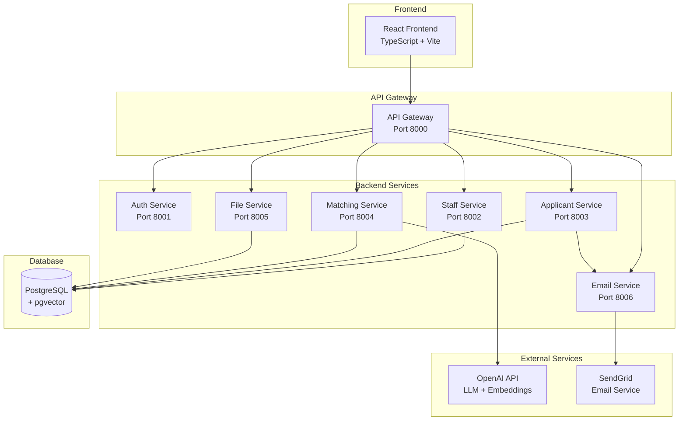
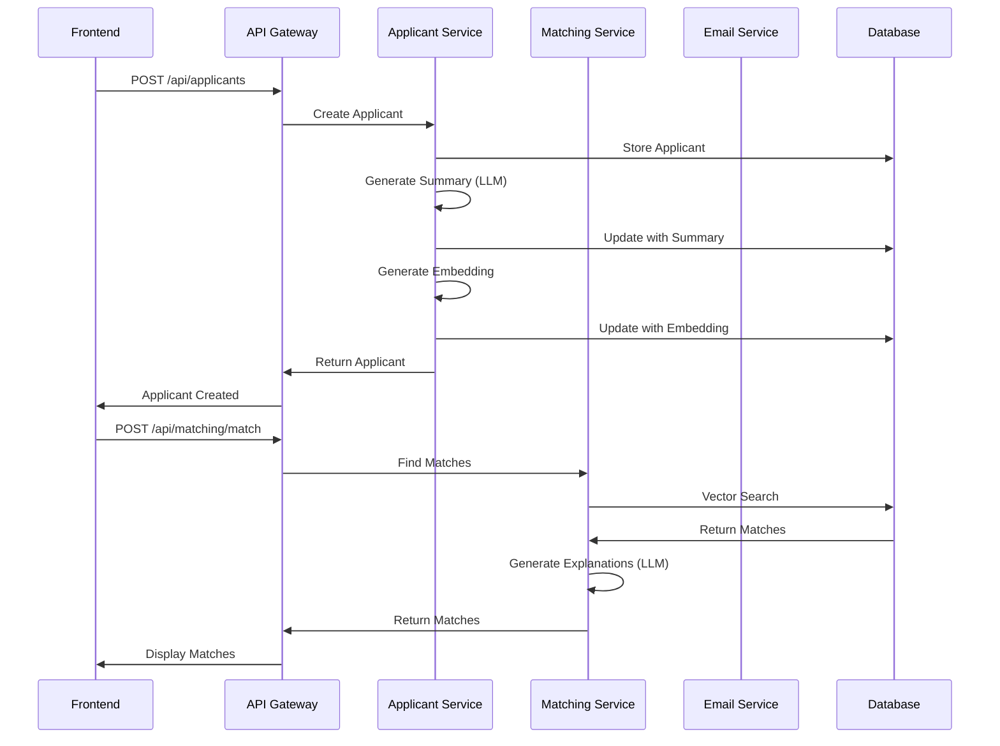

# API Reference

**PGR Supervision Matching System - API Gateway Endpoints**

All API endpoints are accessed through the API Gateway at `http://localhost:8000/api`. The gateway forwards requests to internal microservices.

**Base URL:** `http://localhost:8000/api`

**Authentication:** Currently minimal (placeholder). Most endpoints accept an optional `Authorization` header.

---


## Table of Contents

- [Applicants](#applicants)
- [Allocations](#allocations)
- [Allocation Notes](#allocation-notes)
- [Staff](#staff)
- [Matching](#matching)
- [Files](#files)
- [Staff Reviews](#staff-reviews)
- [Interview Records](#interview-records)
- [Analytics](#analytics)

---

## System Architecture



---

## Request Flow Sequence

The following sequence diagram illustrates the flow of creating an applicant and finding matches:



---


## Applicants

### List Applicants

`GET /api/applicants`

Get a paginated list of applicants with optional filters.

**Query Parameters:**

- `intake_year` (int, optional): Filter by intake year
- `intake_term` (string, optional): Filter by intake term (e.g., "FEB", "SEP")
- `status` (string, optional): Filter by status (`NEW`, `UNDER_REVIEW`, `SUPERVISOR_CONTACTED`, `ACCEPTED`, `REJECTED`, `ON_HOLD`)
- `degree_type` (string, optional): Filter by degree type (`PHD`, `MRES`)
- `page` (int, default: 1): Page number
- `page_size` (int, default: 50, max: 100): Items per page

**Response:**

```json
{
  "items": [
    {
      "id": "uuid",
      "full_name": "Applicant Name",
      "email": "applicant@example.com",
      "degree_type": "PHD",
      "intake_term": "SEP",
      "intake_year": 2026,
      "status": "NEW",
      "primary_theme": "Machine Learning",
      "summary_text": "Research summary...",
      "priority_score": 85.5,
      "ai_detection_probability": 25.0,
      "created_at": "2025-01-15T10:00:00Z"
    }
  ],
  "total": 100,
  "page": 1,
  "page_size": 50,
  "total_pages": 2
}
```

---

### Get Applicant

`GET /api/applicants/{applicant_id}`

Get full details of a specific applicant.

**Path Parameters:**

- `applicant_id` (UUID): Applicant ID

**Response:**

```json
{
  "id": "uuid",
  "full_name": "Applicant Name",
  "email": "applicant@example.com",
  "degree_type": "PHD",
  "intake_term": "SEP",
  "intake_year": 2026,
  "raw_application_text": "Full application text...",
  "summary_text": "Structured summary...",
  "summary_last_updated_at": "2025-01-15T10:00:00Z",
  "topic_keywords": ["AI", "ML", "NLP"],
  "method_keywords": ["Deep Learning", "Neural Networks"],
  "primary_theme": "Machine Learning",
  "secondary_theme": "Natural Language Processing",
  "status": "NEW",
  "priority_score": 85.5,
  "ai_detection_probability": 25.0,
  "quality_rationale": "Clear, specific research proposal...",
  "embedding": [0.123, 0.456, ...],
  "created_at": "2025-01-15T10:00:00Z",
  "updated_at": "2025-01-15T10:00:00Z"
}
```

---

### Create Applicant

`POST /api/applicants`

Create a new applicant record. Triggers automatic summarisation and embedding generation.

**Request Body:**

```json
{
  "full_name": "Applicant Name",
  "email": "applicant@example.com",
  "degree_type": "PHD",
  "intake_term": "SEP",
  "intake_year": 2026,
  "raw_application_text": "Full application text..."
}
```

**Response:** Created applicant object (same structure as Get Applicant)

---

### Batch Upload Applicants

`POST /api/applicants/batch-upload`

Upload multiple PDF files to create applicants automatically.

**Request (multipart/form-data):**

- `files` (File[]): Array of PDF files
- `degree_type` (string, default: "PHD"): Degree type for all applicants
- `intake_term` (string, default: "SEP"): Intake term
- `intake_year` (int, required): Intake year
- `auto_match` (boolean, default: false): Automatically trigger matching for each applicant

**Response:**

```json
{
  "total": 10,
  "successful": 8,
  "failed": 2,
  "results": [
    {
      "filename": "proposal1.pdf",
      "applicant_id": "uuid",
      "status": "success"
    },
    {
      "filename": "proposal2.pdf",
      "status": "error",
      "error": "Failed to extract text"
    }
  ]
}
```

---

### Update Applicant

`PUT /api/applicants/{applicant_id}`

Update an applicant record. May trigger re-embedding if relevant fields change.

**Path Parameters:**

- `applicant_id` (UUID): Applicant ID

**Request Body:** Partial applicant object with fields to update

**Response:** Updated applicant object

---

### Delete Applicant

`DELETE /api/applicants/{applicant_id}`

Hard delete an applicant (cascades to allocations and documents).

**Path Parameters:**

- `applicant_id` (UUID): Applicant ID

**Response:** `{"success": true, "message": "Applicant deleted"}`

---

### Get Applicant Profile

`GET /api/applicants/{applicant_id}/profile`

Get applicant personal profile and educational qualifications.

**Response:**

```json
{
  "applicant_id": "uuid",
  "full_name": "Applicant Name",
  "email": "applicant@example.com",
  "profile": {
    "date_of_birth": "1995-03-10",
    "nationality": "Libyan",
    "country_of_residence": "United Kingdom",
    "phone_number": "+44..."
  },
  "degrees": [
    {
      "id": "uuid",
      "degree_type": "MSc",
      "subject_area": "Artificial Intelligence",
      "university": "USW",
      "university_country": "UK",
      "classification": "Distinction",
      "year_completed": 2024
    }
  ]
}
```

---

### Update Applicant Profile

`PUT /api/applicants/{applicant_id}/profile`

Create or update applicant personal profile.

**Request Body:**

```json
{
  "date_of_birth": "1995-03-10",
  "nationality": "Libyan",
  "country_of_residence": "United Kingdom",
  "phone_number": "+44...",
  "email": "applicant@example.com"
}
```

---

### Add Applicant Degree

`POST /api/applicants/{applicant_id}/degrees`

Add an educational qualification.

**Request Body:**

```json
{
  "degree_type": "MSc",
  "subject_area": "Artificial Intelligence",
  "university": "USW",
  "university_country": "UK",
  "classification": "Distinction",
  "year_completed": 2024
}
```

---

### Update Applicant Degree

`PUT /api/applicants/{applicant_id}/degrees/{degree_id}`

Update an existing degree record.

---

### Delete Applicant Degree

`DELETE /api/applicants/{applicant_id}/degrees/{degree_id}`

Delete a degree record.

---

### Get Document Checklist

`GET /api/applicants/{applicant_id}/documents/checklist`

Get document checklist status for an applicant.

**Response:**

```json
{
  "has_proposal": true,
  "has_cv": false,
  "has_application_form": true,
  "has_transcript": false,
  "missing_documents": ["CV", "TRANSCRIPT"],
  "is_complete": false
}
```

---

### Get Applicant Documents

`GET /api/applicants/{applicant_id}/documents`

Get all documents for an applicant.

**Response:**

```json
[
  {
    "id": "uuid",
    "file_name": "proposal.pdf",
    "document_type": "PROPOSAL",
    "mime_type": "application/pdf",
    "file_size_bytes": 1024000,
    "created_at": "2025-01-15T10:00:00Z"
  }
]
```

---

### Extract Application Form

`POST /api/applicants/{applicant_id}/extract-application-form`

Extract structured data from an uploaded application form document.

**Response:**

```json
{
  "success": true,
  "extracted_data": {
    "full_name": "...",
    "email": "...",
    "date_of_birth": "...",
    ...
  }
}
```

---

### Can Email Participant

`GET /api/applicants/{applicant_id}/can-email-participant`

Check if participant email can be sent (validates status, email, and confirmed allocations).

**Response:**

```json
{
  "canEmail": true,
  "reason": null
}
```

---

### Email Participant

`POST /api/applicants/{applicant_id}/email-participant`

Send congratulatory email to accepted applicant with confirmed supervisors CC'd.

**Response:**

```json
{
  "success": true,
  "message": "Email sent successfully",
  "email_log_id": "uuid"
}
```

---

### Dashboard Intake Summary

`GET /api/applicants/dashboard/intake-summary`

Get aggregated statistics by intake year, term, and status.

**Response:**

```json
{
  "2026": {
    "FEB": {
      "new": 5,
      "supervisor_contacted": 3,
      "accepted": 2,
      "rejected": 1
    },
    "SEP": {
      "new": 10,
      "supervisor_contacted": 5,
      "accepted": 3,
      "rejected": 2
    }
  }
}
```

---

## Allocations

### List Allocations

`GET /api/allocations`

Get allocations with optional filters.

**Query Parameters:**

- `applicant_id` (UUID, optional): Filter by applicant
- `staff_id` (UUID, optional): Filter by staff
- `is_confirmed` (boolean, optional): Filter by confirmation status
- `year` (int, optional): Filter by intake year
- `term` (string, optional): Filter by intake term

**Response:**

```json
[
  {
    "id": "uuid",
    "applicant_id": "uuid",
    "applicant_name": "John Doe",
    "applicant_email": "john@example.com",
    "applicant_status": "NEW",
    "staff_id": "uuid",
    "staff_name": "Dr. Smith",
    "staff_email": "smith@usw.ac.uk",
    "role": "DOS",
    "match_score": 0.93,
    "explanation": "Dr. Smith works on...",
    "is_confirmed": false,
    "confirmed_at": null,
    "created_at": "2025-01-15T10:00:00Z"
  }
]
```

---

### Get Allocations by Intake

`GET /api/allocations/intake`

Get allocations summary for a specific intake.

**Query Parameters:**

- `year` (int, required): Intake year
- `term` (string, required): Intake term

**Response:** Array of allocation objects

---

### Create Allocation

`POST /api/allocations`

Create a new allocation (suggestion or confirmed).

**Request Body:**

```json
{
  "applicant_id": "uuid",
  "staff_id": "uuid",
  "role": "DOS",
  "is_confirmed": false,
  "match_score": 0.93,
  "explanation": "Match explanation..."
}
```

**Response:** Created allocation object

---

### Update Allocation

`PUT /api/allocations/{allocation_id}`

Update an allocation (e.g., confirm/unconfirm, change role). Automatically updates staff supervision counts.

**Path Parameters:**

- `allocation_id` (UUID): Allocation ID

**Request Body:** Partial allocation object

**Response:** Updated allocation object

---

### Delete Allocation

`DELETE /api/allocations/{allocation_id}`

Delete an allocation. Automatically updates staff supervision counts if allocation was confirmed.

**Path Parameters:**

- `allocation_id` (UUID): Allocation ID

**Response:** `{"success": true, "message": "Allocation deleted"}`

---

### Send Allocation Email

`POST /api/allocations/{allocation_id}/send-email`

Send email notification to supervisor with application details.

**Path Parameters:**

- `allocation_id` (UUID): Allocation ID

**Response:**

```json
{
  "success": true,
  "message": "Email sent successfully",
  "message_id": "email-message-id"
}
```

---

## Allocation Notes

### Get Allocation Notes

`GET /api/allocations/{allocation_id}/notes`

Get all notes for a specific allocation, organized as threaded conversations.

**Path Parameters:**

- `allocation_id` (UUID): Allocation ID

**Response:**

```json
[
  {
    "id": "uuid",
    "applicant_id": "uuid",
    "allocation_id": "uuid",
    "parent_note_id": null,
    "author_user_id": "uuid",
    "author": {
      "id": "uuid",
      "full_name": "Dr. Smith",
      "email": "smith@usw.ac.uk",
      "role": "PGR_LEAD"
    },
    "note_text": "Initial review completed. Strong candidate.",
    "is_sent_to_staff": false,
    "sent_at": null,
    "is_deleted": false,
    "created_at": "2025-01-15T10:00:00Z",
    "updated_at": null,
    "replies": [
      {
        "id": "uuid",
        "parent_note_id": "uuid",
        "note_text": "Agreed. Moving forward with allocation.",
        "author": {
          "full_name": "Dr. Jones"
        },
        "created_at": "2025-01-15T11:00:00Z"
      }
    ]
  }
]
```

---

### Create Allocation Note

`POST /api/allocations/{allocation_id}/notes`

Create a new note for an allocation.

**Path Parameters:**

- `allocation_id` (UUID): Allocation ID

**Request Body:**

```json
{
  "author_user_id": "uuid",
  "note_text": "Note content...",
  "send_to_staff": false
}
```

**Response:** Created note object (same structure as Get Allocation Notes)

---

### Reply to Allocation Note

`POST /api/allocations/{allocation_id}/notes/{parent_note_id}/reply`

Reply to an existing note (threading).

**Path Parameters:**

- `allocation_id` (UUID): Allocation ID
- `parent_note_id` (UUID): Parent note ID

**Request Body:**

```json
{
  "author_user_id": "uuid",
  "note_text": "Reply content...",
  "send_to_staff": false
}
```

**Response:** Created reply note object

---

### Update Allocation Note

`PUT /api/allocations/{allocation_id}/notes/{note_id}`

Update an existing note.

**Path Parameters:**

- `allocation_id` (UUID): Allocation ID
- `note_id` (UUID): Note ID

**Request Body:**

```json
{
  "author_user_id": "uuid",
  "note_text": "Updated note content..."
}
```

**Response:** Updated note object

---

### Delete Allocation Note

`DELETE /api/allocations/{allocation_id}/notes/{note_id}`

Soft delete a note (marks as deleted, doesn't remove from database).

**Path Parameters:**

- `allocation_id` (UUID): Allocation ID
- `note_id` (UUID): Note ID

**Request Body:**

```json
{
  "author_user_id": "uuid"
}
```

**Response:** `{"success": true, "message": "Note deleted"}`

---

## Staff

### List Staff

`GET /api/staff`

Get a paginated list of staff with optional filters.

**Query Parameters:**

- `active` (boolean, optional): Filter by active status
- `keyword` (string, optional): Search in research interests, methods, keywords
- `can_be_dos` (boolean, optional): Filter by DoS eligibility
- `can_supervise_phd` (boolean, optional): Filter by PhD supervision capability
- `can_supervise_mres` (boolean, optional): Filter by MRes supervision capability
- `has_capacity_phd` (boolean, optional): Filter by PhD capacity
- `has_capacity_mres` (boolean, optional): Filter by MRes capacity
- `page` (int, default: 1): Page number
- `page_size` (int, default: 50, max: 100): Items per page

**Response:**

```json
{
  "items": [
    {
      "id": "uuid",
      "full_name": "Dr. Smith",
      "email": "smith@usw.ac.uk",
      "role_title": "Senior Lecturer",
      "school": "Computing",
      "research_group": "AI Research Group",
      "can_be_dos": true,
      "can_supervise_phd": true,
      "can_supervise_mres": true,
      "max_phd_supervisions": 5,
      "max_mres_supervisions": 10,
      "current_phd_supervisions": 3,
      "current_mres_supervisions": 2,
      "research_interests_text": "Machine Learning, NLP",
      "methods_text": "Deep Learning, Statistical Analysis",
      "keywords": ["AI", "ML", "NLP"],
      "active": true,
      "has_embedding": true
    }
  ],
  "total": 50,
  "page": 1,
  "page_size": 50,
  "total_pages": 1
}
```

---

### Get Staff

`GET /api/staff/{staff_id}`

Get full details of a specific staff member.

**Path Parameters:**

- `staff_id` (UUID): Staff ID

**Response:** Full staff object

---

### Create Staff

`POST /api/staff`

Create a new staff member. Automatically generates embedding.

**Request Body:**

```json
{
  "full_name": "Dr. Smith",
  "email": "smith@usw.ac.uk",
  "role_title": "Senior Lecturer",
  "school": "Computing",
  "research_group": "AI Research Group",
  "can_be_dos": true,
  "can_supervise_phd": true,
  "can_supervise_mres": true,
  "max_phd_supervisions": 5,
  "max_mres_supervisions": 10,
  "research_interests_text": "Machine Learning, NLP",
  "methods_text": "Deep Learning, Statistical Analysis",
  "keywords": ["AI", "ML", "NLP"]
}
```

**Response:** Created staff object

---

### Update Staff

`PUT /api/staff/{staff_id}`

Update a staff member. Regenerates embedding if research interests/methods change.

**Path Parameters:**

- `staff_id` (UUID): Staff ID

**Request Body:** Partial staff object

**Response:** Updated staff object

---

### Delete Staff

`DELETE /api/staff/{staff_id}`

Soft delete a staff member (sets `active=false`).

**Path Parameters:**

- `staff_id` (UUID): Staff ID

**Response:** `{"success": true, "message": "Staff deleted"}`

---

## Matching

### Find Matches

`POST /api/matching/match`

Find matching supervisors for an applicant. Triggers vector similarity search and LLM explanation generation.

**Request Body:**

```json
{
  "applicant_id": "uuid",
  "applicant_name": "John Doe",
  "degree_type": "PHD",
  "applicant_summary": "Research summary...",
  "applicant_topics": ["AI", "ML"],
  "applicant_methods": ["quantitative"],
  "applicant_embedding": [0.1, 0.2, ...],
  "require_dos": false,
  "min_score": 0.0,
  "require_capacity": true,
  "limit": 20
}
```

**Response:**

```json
[
  {
    "staff_id": "uuid",
    "full_name": "Dr. Smith",
    "email": "smith@usw.ac.uk",
    "role_title": "Senior Lecturer",
    "school": "Computing",
    "research_group": "AI Research Group",
    "can_be_dos": true,
    "research_interests": "Machine Learning, NLP",
    "methods": "Deep Learning, Statistical Analysis",
    "keywords": ["AI", "ML", "NLP"],
    "match_score": 0.93,
    "capacity_status": "AVAILABLE",
    "role_suggestion": "DOS",
    "explanation": "Dr. Smith works on machine learning and NLP, which aligns well with the applicant's research interests..."
  }
]
```

---

### Get Stored Matches

`GET /api/matching/matches/{applicant_id}`

Get stored match recommendations for an applicant (most recent set).

**Path Parameters:**

- `applicant_id` (UUID): Applicant ID

**Response:** Array of match objects (same structure as Find Matches response)

---

### Get Match Timestamp

`GET /api/matching/matches/{applicant_id}/timestamp`

Get the timestamp of when matches were last generated.

**Path Parameters:**

- `applicant_id` (UUID): Applicant ID

**Response:**

```json
{
  "timestamp": "2025-01-15T10:00:00Z"
}
```

---

## Files

### Upload File

`POST /api/files/upload`

Upload a file (PDF, DOCX, etc.) with document type classification.

**Request (multipart/form-data):**

- `file` (File, required): File to upload
- `applicant_id` (UUID, optional): Applicant ID to associate file with
- `document_type` (string, default: "PROPOSAL"): Document type (`PROPOSAL`, `CV`, `APPLICATION_FORM`, `TRANSCRIPT`)

**Response:**

```json
{
  "id": "uuid",
  "file_name": "proposal.pdf",
  "document_type": "PROPOSAL",
  "mime_type": "application/pdf",
  "file_size_bytes": 1024000,
  "created_at": "2025-01-15T10:00:00Z"
}
```

---

### Get File

`GET /api/files/{file_id}`

Get file metadata.

**Path Parameters:**

- `file_id` (UUID): File ID

**Response:** File metadata object

---

### Download File

`GET /api/files/{file_id}/download`

Download a file.

**Path Parameters:**

- `file_id` (UUID): File ID

**Response:** File content (binary)

---

### Extract Text from File

`GET /api/files/{file_id}/extract-text`

Extract text content from a file (PDF, DOCX, etc.).

**Path Parameters:**

- `file_id` (UUID): File ID

**Response:**

```json
{
  "text": "Extracted text content...",
  "file_name": "proposal.pdf"
}
```

---

### Delete File

`DELETE /api/files/{file_id}`

Delete a file and its database record.

**Path Parameters:**

- `file_id` (UUID): File ID

**Response:** `{"success": true, "message": "File deleted"}`

---

## Staff Reviews

### Get Staff Review by Allocation

`GET /api/staff-reviews/allocation/{allocation_id}`

Get staff review for a specific allocation.

**Path Parameters:**

- `allocation_id` (UUID): Allocation ID

**Response:**

```json
{
  "id": "uuid",
  "allocation_id": "uuid",
  "staff_id": "uuid",
  "applicant_id": "uuid",
  "reviewer_name": "Dr. Smith",
  "applicant_name_review": "John Doe",
  "review_date": "2025-01-15",
  "research_question_acceptable": true,
  "research_framework_acceptable": true,
  "writing_structure_acceptable": true,
  "contribution_to_field": "High",
  "recommend_for_supervision": true,
  "prepared_to_supervise": true,
  "sufficient_ethics": true,
  "suggested_supervisors": "Dr. Jones",
  "overseas_research_risk": "Low",
  "reputational_risk": "Low",
  "risk_matrix_completed": true,
  "recommendation": "Accept",
  "reasons_summary": "Strong proposal...",
  "comments_to_applicant": "Well done...",
  "date_returned_to_graduate_school": "2025-01-20"
}
```

---

### Create or Update Staff Review

`POST /api/staff-reviews`

Create or update a staff review.

**Request Body:**

```json
{
  "allocation_id": "uuid",
  "staff_id": "uuid",
  "applicant_id": "uuid",
  "reviewer_name": "Dr. Smith",
  "applicant_name_review": "John Doe",
  "review_date": "2025-01-15",
  "research_question_acceptable": true,
  "research_framework_acceptable": true,
  "writing_structure_acceptable": true,
  "contribution_to_field": "High",
  "recommend_for_supervision": true,
  "prepared_to_supervise": true,
  "sufficient_ethics": true,
  "suggested_supervisors": "Dr. Jones",
  "overseas_research_risk": "Low",
  "reputational_risk": "Low",
  "risk_matrix_completed": true,
  "recommendation": "Accept",
  "reasons_summary": "Strong proposal...",
  "comments_to_applicant": "Well done...",
  "date_returned_to_graduate_school": "2025-01-20"
}
```

**Response:** Created/updated review object

---

### Generate AI Review

`POST /api/staff-reviews/{allocation_id}/generate-ai-review`

Generate an AI-powered review for an allocation.

**Path Parameters:**

- `allocation_id` (UUID): Allocation ID

**Response:** Generated review object

---

## Interview Records

### List Interview Records

`GET /api/interview-records`

Get a list of interview records with optional filters.

**Query Parameters:**

- `applicant_id` (UUID, optional): Filter by applicant
- `staff_id` (UUID, optional): Filter by staff member
- `status` (string, optional): Filter by status (`IN_PROCESS`, `COMPLETED`)

**Response:**

```json
[
  {
    "id": "uuid",
    "allocation_id": "uuid",
    "staff_id": "uuid",
    "applicant_id": "uuid",
    "status": "IN_PROCESS",
    "interviewer_name": "Dr. Smith",
    "applicant_name_interview": "John Doe",
    "interview_date": "2025-01-15",
    "interview_location": "Room 305",
    "is_submitted": false,
    "submitted_at": null,
    "created_at": "2025-01-15T10:00:00Z",
    "updated_at": "2025-01-15T10:00:00Z"
  }
]
```

---

### Get Interview Record

`GET /api/interview-records/{record_id}`

Get full details of a specific interview record.

**Path Parameters:**

- `record_id` (UUID): Interview record ID

**Response:**

```json
{
  "id": "uuid",
  "allocation_id": "uuid",
  "staff_id": "uuid",
  "applicant_id": "uuid",
  "status": "COMPLETED",
  "interviewer_name": "Dr. Smith",
  "applicant_name_interview": "John Doe",
  "interview_date": "2025-01-15",
  "interview_location": "Room 305",
  "educational_background": "MSc in Computer Science...",
  "work_experience": "Software engineer for 3 years...",
  "research_experience": "Published 2 papers in ML conferences...",
  "research_topic_clarity": "Very clear understanding of the research area...",
  "research_objectives_understanding": "Well-defined objectives...",
  "methodology_knowledge": "Strong methodological approach...",
  "literature_awareness": "Excellent awareness of current literature...",
  "motivation_for_research": "Highly motivated...",
  "understanding_of_phd_demands": true,
  "time_commitment_feasibility": "Full-time commitment available...",
  "analytical_skills": "Strong analytical abilities...",
  "writing_communication_skills": "Clear communicator...",
  "critical_thinking": "Demonstrates critical thinking...",
  "technical_skills": "Proficient in Python, R, and TensorFlow...",
  "expectations_from_supervision": "Regular meetings and feedback...",
  "working_style_preference": "Independent but collaborative...",
  "support_needs": "Access to GPU cluster...",
  "strengths_observed": "Strong technical background...",
  "areas_of_concern": "None identified...",
  "overall_impression": "Excellent candidate...",
  "recommendation": "Strongly recommend for admission",
  "additional_notes": "Enthusiastic and well-prepared",
  "is_submitted": true,
  "submitted_at": "2025-01-15T15:00:00Z",
  "created_at": "2025-01-15T10:00:00Z",
  "updated_at": "2025-01-15T15:00:00Z"
}
```

---

### Get Interview Record by Allocation

`GET /api/interview-records/allocation/{allocation_id}`

Get interview record for a specific allocation.

**Path Parameters:**

- `allocation_id` (UUID): Allocation ID

**Response:** Interview record object (same structure as Get Interview Record)

---

### Create or Update Interview Record

`POST /api/interview-records`

Create a new interview record or update an existing one.

**Request Body:**

```json
{
  "allocation_id": "uuid",
  "staff_id": "uuid",
  "applicant_id": "uuid",
  "status": "IN_PROCESS",
  "interviewer_name": "Dr. Smith",
  "applicant_name_interview": "John Doe",
  "interview_date": "2025-01-15",
  "interview_location": "Room 305",
  "educational_background": "...",
  "work_experience": "...",
  "research_experience": "...",
  "research_topic_clarity": "...",
  "research_objectives_understanding": "...",
  "methodology_knowledge": "...",
  "literature_awareness": "...",
  "motivation_for_research": "...",
  "understanding_of_phd_demands": true,
  "time_commitment_feasibility": "...",
  "analytical_skills": "...",
  "writing_communication_skills": "...",
  "critical_thinking": "...",
  "technical_skills": "...",
  "expectations_from_supervision": "...",
  "working_style_preference": "...",
  "support_needs": "...",
  "strengths_observed": "...",
  "areas_of_concern": "...",
  "overall_impression": "...",
  "recommendation": "...",
  "additional_notes": "...",
  "is_submitted": false
}
```

**Response:** Created/updated interview record object

**Notes:**

- If an interview record already exists for the allocation, it will be updated
- Set `is_submitted: true` and provide `submitted_at` to mark as completed

---

## Analytics

All analytics endpoints require SMT role (`require_smt_role` dependency).

### Get Topic Analytics

`GET /api/applicants/analytics/topics`

Get topic distribution analytics.

**Response:** Topic statistics and distribution data

---

### Get Topics by Research Group

`GET /api/applicants/analytics/topics-by-research-group`

Get topics grouped by research group.

**Response:** Research group topic breakdown

---

### Get Topics by Theme

`GET /api/applicants/analytics/topics-by-theme`

Get topics grouped by primary and secondary themes.

**Response:** Theme topic breakdown

---

### Get Statistics

`GET /api/applicants/analytics/statistics`

Get comprehensive application statistics (status breakdown, degree breakdown, intake trends, research group coverage).

**Response:**

```json
{
  "status_breakdown": {...},
  "degree_breakdown": {...},
  "intake_trends": {...},
  "research_group_coverage": {...}
}
```

---

### Get Accelerators

`GET /api/applicants/analytics/accelerators`

Get accelerator distribution analytics.

**Response:** Accelerator statistics

---

### Get Research Group Themes

`GET /api/applicants/analytics/research-group-themes`

Get research group theme distribution.

**Response:** Research group theme breakdown

---

### Get Accelerator-Research Theme Correlation

`GET /api/applicants/analytics/accelerator-research-theme-correlation`

Get correlation matrix between accelerators and research themes.

**Response:** Correlation matrix data

---

### Get Staff Capacity Analytics

`GET /api/applicants/analytics/staff-capacity`

Get comprehensive staff capacity and load analytics.

**Response:**

```json
{
  "summary": {
    "total_staff": 50,
    "staff_with_capacity_phd": 30,
    "staff_at_capacity_phd": 15,
    "staff_over_capacity_phd": 5,
    ...
  },
  "staff_details": [...],
  "by_school": {...},
  "by_research_group": {...}
}
```

---

### Get Acceptance Rates

`GET /api/applicants/analytics/acceptance-rates`

Get acceptance rate analytics.

**Response:** Acceptance rate statistics

---

## Error Responses

All endpoints may return standard HTTP error responses:

**400 Bad Request:**

```json
{
  "detail": "Error message describing the issue"
}
```

**404 Not Found:**

```json
{
  "detail": "Resource not found"
}
```

**500 Internal Server Error:**

```json
{
  "detail": "Internal server error message"
}
```

**502 Bad Gateway:**

```json
{
  "detail": "Service unavailable: [service name]"
}
```

**504 Gateway Timeout:**

```json
{
  "detail": "Service request timeout"
}
```

---

## Rate Limiting

Currently no rate limiting is implemented. This may be added in future versions.

---

## Versioning

Current API version: **v1** (implicit)

API versioning may be added in future versions (e.g., `/api/v1/...`).

---

## Related Documentation

- **Technical Specification:** `docs/spec.md`
- **Database Schema:** `docs/database_schema.md`
- **Matching Logic:** `Docuemntation/matching_and_allocation_logic.md`

---

## Maintainer

Dr. Mabrouka Abuhmida
Research & Innovation Lead
University of South Wales

**Last Updated:** November 24, 2025
